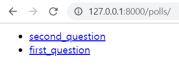

Django Tutorial - 설문조사
--------------------------
'Django(장고)로 쉽게 배우는 배프의 오지랖 파이썬 웹 프로그래밍'의 튜토리얼 부분을 따라하면서 복습하고자 한다.
### 데이터베이스에 변경사항 반영하기
```python
# 데이터베이스를 만들고 초기화, 주로 데이터베이스 관련 설정이 끝난 직후 실행
python manage.py migrate
```

```python
# 앱의 변경사항을 추적해 데이터베이스에 적용할 내용을 만들어 냄
> python manage.py makemigrations polls
Migrations for 'polls':
  polls\migrations\0001_initial.py
    - Create model Question
    - Create model Choice
```


```python
# 어떤 SQL 구문이 실행될 지 확인하는 명령어
> manage.py sqlmigrate polls 0001
BEGIN;
--
-- Create model Question
--
CREATE TABLE "polls_question" ("id" integer NOT NULL PRIMARY KEY AUTOINCREMENT, "question_text" varchar(200) NOT NULL, "pub_date" datetime NOT NULL);
--
-- Create model Choice
--
CREATE TABLE "polls_choice" ("id" integer NOT NULL PRIMARY KEY AUTOINCREMENT, "choice_text" varchar(200) NOT NULL, "votes" integer NOT NULL, "question_id" integer NOT NULL REFERENCES "polls_question" ("id") DEFERR
ABLE INITIALLY DEFERRED);
CREATE INDEX "polls_choice_question_id_c5b4b260" ON "polls_choice" ("question_id");
COMMIT;
```

```python
# 데이터베이스에 변경사항 반영
> python manage.py migrate polls
Operations to perform:
  Apply all migrations: polls
Running migrations:
  Applying polls.0001_initial... OK
```

### 관리자 페이지 확인하기
아래 명령어를 통해 superuser 생성  
```python manage.py createsuperuser```

관리자 페이지에 모델을 관리하려면 admin.py에서 등록
```python
# polls/admin.py
from .models import Question
admin.site.register(Question)
```

### View 구현
```python
# polls/views.py
def index(request):
    latest_question_list = Question.objects.order_by('-pub_date')[:5]
    context = {
        'latest_question_list': latest_question_list
    }
    '''
    # 주석된 코드와 아래 코드는 동일한 기능을 수행함
    template = loader.get_template('polls/index.html')
    return HttpResponse(template.render(context, request))
    '''
    return render(request, 'polls/index.html',context)
```
템플릿과 뷰가 정상적으로 적용됬을 경우 아래와 같이 표시가 된다.  



```pprint(dir(latest_question_list[0]))``` 
명령어를 통해 Question Instance가 가지고 있는 프로퍼티, 메소드들을 조회해보면 아래와 같다.
Model에서 정의한 필드 값들은 물론 id, objects 등 다양한 값들을 상속받았음을 알 수 있다.
```python
 'check',
 'choice_set',
 'clean',
 'clean_fields',
 'date_error_message',
 'delete',
 'from_db',
 'full_clean',
 'get_deferred_fields',
 'get_next_by_pub_date',
 'get_previous_by_pub_date',
 'id',
 'objects',
 'pk',
 'prepare_database_save',
 'pub_date',
 'question_text',
 'refresh_from_db',
 'save',
 'save_base',
 'serializable_value',
 'unique_error_message',
 'validate_unique',
 'was_published_recently']
```

### Queries - Related Objects (Backward)
>If a model has a ForeignKey, instances of the foreign-key model will have access to a Manager that returns all instances of the first model. By default, this Manager is named FOO_set, where FOO is the source model name, lowercased. This Manager returns QuerySets, which can be filtered and manipulated as described in the “Retrieving objects” section above.   

```python
>>> b = Blog.objects.get(id=1)
>>> b.entry_set.all() # Returns all Entry objects related to Blog.

# b.entry_set is a Manager that returns QuerySets.
>>> b.entry_set.filter(headline__contains='Lennon')
>>> b.entry_set.count()
```
[Reference](https://docs.djangoproject.com/en/1.10/topics/db/queries/#related-objects)
  
즉, 모델이 외래키를 가지고 있을 경우, XXX_set이라는 Manager를 return 받을 수 있고 
해당 Manager는 object를 조작할 수 있는 QuerySets을 반환하므로 이를 사용할 수 있다는 내용이다.

Template에서 아래 문법이 적용되었다.
```python
# polls/templates/polls/detail.html

    <li>{{ choice.choice_text }}</li>

```

### Form에서 데이터 받기
> CSRF 공격(Cross Site Request Forgery)은 웹 어플리케이션 취약점 중 하나로 인터넷 사용자(희생자)가 자신의 의지와는 무관하게 공격자가 의도한 행위(수정, 삭제, 등록 등)를 특정 웹사이트에 요청하게 만드는 공격입니다.  
출처: https://itstory.tk/entry/CSRF-공격이란-그리고-CSRF-방어-방법 [덕's IT Story]  
  
Form의 submit 버튼을 누르게 되면, polls:vote View에 name:value (choice:choice.id) 형태의 데이터를 전달하게 된다.
```python
# polls/templates/polls/detail.html
<form action="" method="post">
    
    
        <input type="radio" name="choice" id="choice{{ forloop.counter }}" value="{{ choice.id }}">
        <label for="choice{{ forloop.counter }}">{{ choice.choice_text }}</label><br>
    
    <input type="submit" value="Vote">
</form>
```
vote 뷰에서는 request.POST[변수이름]을 통해 전달받은 값을 확인할 수 있다. (항상 문자열)
이를 통해 정상적인 값이 들어왔는지 검증 후 예외가 발생하지 않을 경우 votes를 1 올리고 저장한다.

reverse는 url template tag와 비슷한 역할을 수행한다.
>If you need to use something similar to the url template tag in your code, Django provides the following function   
[Reference](https://docs.djangoproject.com/en/3.0/ref/urlresolvers/#reverse)

```python
# polls/views.py
def vote(request, question_id):
    question = get_object_or_404(Question, pk=question_id)
    try:
        selected_choice = question.choice_set.get(pk=request.POST['choice'])
    except (KeyError, Choice.DoesNotExist):
        # Redisplay the question voting form.
        return render(request, 'polls/detail.html', {
            'question' : question,
            'error_message' : "You didn't select a choice.",
        })
    else:
        selected_choice.votes += 1
        selected_choice.save()

    return HttpResponseRedirect(reverse('polls:results', args=(question.id,)))
```

### render에 왜 requests가 필요한가?
굳이 template에 context만 추가해서 로딩하는데, request가 필요한가? 라는 생각이 들었다.  
먼저 render의 사용방법 및 설명은 아래와 같다.
> render(request, template_name, context=None, content_type=None, status=None, using=None)  
Combines a given template with a given context dictionary and returns an HttpResponse object with that rendered text.  

전달받은 템플릿과 Context Dict를 합쳐서 rendered text와 함께 HttpResponse를 전달하는 메소드이다.
stackoverflow에 따르면, Template context processors가 request를 인자로 받아서 context가 포함된 dictionary로 return한다고 한다. [참조](https://stackoverflow.com/questions/25640966/why-does-djangos-render-function-need-the-request-argument)

또한, 이 [블로그](https://devlog.jwgo.kr/2017/02/22/wtdb-render-render-to-response/)에 따르면 아래와 같이 설명하고 있다.
> 위 ‘사용법’의 마지막 줄을 보면 render_to_response() 함수에서는 안보이는 request 매개변수가 render() 함수에 보인다. request 변수가 없으면 렌더링된 템플릿에서 user, session, site 등 유용하고 중요한 값을 사용하기 힘들어진다.

결론은, 그냥 군말없이 사용하자.. request에 아래와 같이 굉장히 많은 프로퍼티, 메소드 들이 저장되어 있다.
```python
pprint(dir(request))
['COOKIES',
 'FILES',
 'GET',
 'META',
 'POST',
 ...
 'body',
 'build_absolute_uri',
 'close',
 'content_params',
...
```

### template syntax - pluralize 
> pluralize 필터는 말 그대로 복수형으로 만들어주는 기능을 한다. 만약 choice_votes가 2 이상이라면, 앞의 vote 문자열에 s를 붙여주어 복수로 되게 한다. 이에 대한 자세한 설명은 Django Docs를 참고하자.
> [참조 블로그](http://guswnsxodlf.github.io/following-django-tutorial-4)

### Generic View
장고에서 미리 준비한 뷰를 의미하며, 일반적으로 사용되는 뷰는 대부분 구현이 되어있다.
아래와 같은 형태이다.
```python
class IndexView(generic.ListView):
    template_name = 'polls/index.html'
    context_object_name = 'latest_question_list'

    def get_queryset(self):
        """Return the last five published questions."""
        return Question.objects.order_by('-pub_date')[:5]

class DetailView(generic.DetailView):
    model = Question
    template_name = 'polls/detail.html'
```
클래스로써 지원이 되고, 코드가 훨씬 간결해졌음을 알 수 있다. 
또한, urls.py의 urlpattern도 변경해주어야 한다고 하는데, 아래와 같이 as_view() 함수를 사용한다.  
as_view() 함수는 아래에 잘 설명된 블로그가 있어 참조한다.
> ... as_view() 메소드에 의해 리턴되는 view 함수는 dispatch() 메소드에 request를 전달한다. 그러면 dispatch() 메소드는 request 타입(GET, POST, PUT 등)에 따른 적합한 메소드를 실행한다.  
> 출처: https://yuda.dev/245 [YUDA't]

### 관리자 폼 커스터마이징
admin.py에서 ModelAdmin을 상속받는 클래스를 만들고 register에 두 번째 인자로 등록  
상세 내용은 코드 참조
